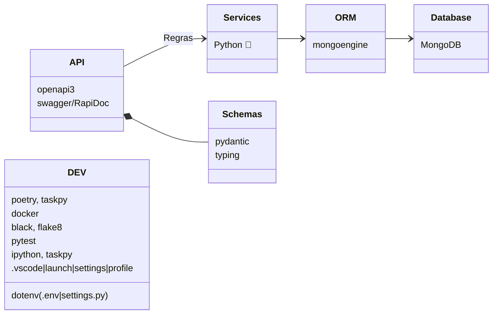

# 🦝 Star Wars Guru API

## ✅ Execução do projeto

- [✅] Setup do projeto com Poetry
- [✅] Endpoint /api/status usando swagger
- [✅] 1o. Test na API de status com Pytest
- [✅] Variáveis via .env com dotenv
- [✅] Subir mongo com docker-compose
- [✅] Criar tests de API do Planet
- [✅] Criar services Planet para salvar na collection do mongo
- [  ] Deploy
- [  ] Testar o Dockerfile do backend e adicionar no compose
- [  ] Fazer um teste de carga usando k6
- [  ] CI & CD
- [  ] Proteger as rotas POST/PUT/DELETE
- [  ] Paginação nas rotas de listas
- [  ] Adicionar Rate Limit


## Problemas conhecidos

- Deletar Planeta com referências de films
    - Solução 1: Remover as referências do film antes de apagar o Planeta
    - Solução 2: Só permitir deletar Planeta com films: []
- Mesma coisa para o deletar Film com referências


## 📂 Organização




## ⭐ Stack & Motivações

- **Flask | MongoDB | MongoEngine**: Utilizar o que estava no desafio + Aprender Mongo
- **API | openapi3 | Pydantic**: Utilizar stack que facilita migração para FastAPI ou Django Ninja
- **Camada de Services**: Utilizando 🐍 Python Puro -> Mais fácil de testar, migrar para outra stack, exportar para um micro serviço etc...
- **Services | "Arq. Hexagonal"**: Em resumo manter uma forma onde uma forma tem um isolamento, por exemplo, não passar objetos do ORM para a camada de API, não passar Schema da API para a camada de serviço.
- **Docker**: Facilita muito subir mongo (ou qualquer outra dependência) localmente, Ambiente Local mais próximo de PROD
- **Black, Linter**: Melhorar qualidade código, diminuir problemas de merge


## 🏁 Iniciando


### Requisitos:

- Com docker: Teoricamente, apenas docker e docker compose
- "Sem docker": Subir apenas o banco no docker e flask local
    - Python 3.11 (Não testei em outras versões)
    - Poetry


### Iniciando o projeto

```bash
##1  Clonar repo
git clone https://github.com/huogerac/flask-api-mongodb.git
cd flask-api-mongodb/

##2 Virtual env e instalar dependências
poetry config virtualenvs.in-project true  ## para criar a pasta .venv 
poetry shell
poetry install

🌈 DICA: veja os comandos usados no projeto (taskpy)
poetry run task --list 

##3 Subir o banco de dados (Mongodb) | Veja o .env para ver as variáveis
task up 
## OU pode rodar: 'docker compose up -d --build'
## Garanta que o mongo está rodando
docker ps
docker compose logs -f mongo

##4 Agora só rodar o flask
task runserver
## OU pode rodar: 'flask --app starwarsguru/app run'

🎉 DONE!

##5 Agora só acessar as URLS: 
http://localhost:5000
http://localhost:5000/openapi/rapidoc

```

### Mais comandos


## Listar os comandos mais usados:

```bash
❯ poetry run task --list
active    Active the virtualenv.
format    Format the code.
lint      Run the linter to check PEP8.
test      Run the tests and fail in the first one.
test-cov  Run the tests and give us the test coverage report.
runserver Run the flask api server
shell     Run the interactive shell
dbshell   Run the mongo shell
up        Up the services containers.
down      Down the services containers.
```


## Acessando o banco

```bash
task dbshell

use swgurudb
show collections
db.film.find()
```


## Rodando os tests

```bash
pytest 
# OU
task test-cov
```


## URLS

http://localhost:5000/openapi/rapidoc


## LINKS
- https://swapi.dev/

## MONGODB
- https://snyk.io/advisor/python/mongoengine/functions/mongoengine.fields.ListField
- https://docs.mongoengine.org/guide/querying.html
- https://flask.palletsprojects.com/en/2.3.x/patterns/mongoengine/
- http://mongoengine.org/
- https://www.mongodb.com/resources/products/compatibilities/setting-up-flask-with-mongodb
- https://www.mongodb.com/pt-br/docs/manual/reference/database-references/
- https://www.mongodb.com/developer/products/mongodb/cheat-sheet/

## API
- https://luolingchun.github.io/flask-openapi3/latest/Example/#simple-demo


## MONGO QUERIES

```
q2 = Planet.objects.filter(id__in=["66e1e3152fa748ca3839b34c"])

Planet.objects.filter(id__in=["66e1e3152fa748ca3839b34c", "66e1e31b2fa748ca3839b34e"])
    .update(add_to_set__films=['66e1eda75682fd0312c4f0ee'])
Out[13]: 2


# Filtra os planetas que tem o filme 66e21eb69e704403325c1829 e que seja diferene do planeta 2
query = Planet.objects.filter(films__contains='66e21eb69e704403325c1829').filter(id__nin=[str(planet_two.id)])

```